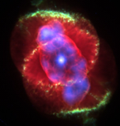
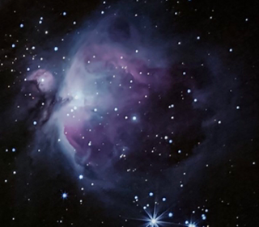
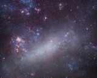
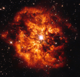

-  Nebulae Emissions
	-  Types
		-  Planetary Nebulae
			
		-  HII Regions
			-  Orion Nebula
				-- *The radius of the Orion Nebula is a few parsecs*
				
			-  Dorados in the LMC
				-- *Giant region on the order of 100 parsecs*
				
		-  Wolf-Rayet Shells
			
		-  AGNs
	-  Basic Physics
		-  Stromgren Sphere
			-  Emission rate vs recombination rate
				-- *4/3 pi R\^3\^ e n\`e\` n\`p\` a\`B\` (T(e)) = Q (N, Teff, L)  where Q is the ionization rate*
				-   Cooling
		-  Massive Stars

			--  (*Relation Note: (12) emit large amounts of*)
			-  UV Ionization
				-  Ionization Bounded
				-  Matter Bounded
	-  Spectral Analysis
		-- [https://iopscience.iop.org/article/10.1088/1538-3873/aa72c3/pdf](https://iopscience.iop.org/article/10.1088/1538-3873/aa72c3/pdf)
		-  Hydrogen (Balmer & Lyman)
		-  Helium
		-  Oxygen (OI, OII, OIII)
			-- *A good example of a collisional excitation line coolant is the OIII 4959, 5007 doublet, emitted by doubly ionized oxygen - a main coolant of HII regions. These emissions give the greenish hue to HII regions like the Orion Nebula.*
		-  Nitrogen (NII)

Relations:
- (13) UV Ionization-> *causes* -> (9) Stromgren Sphere
- (11)  Cooling-> *caused by molecular examples* -> (19) Oxygen (OI, OII, OIII)
